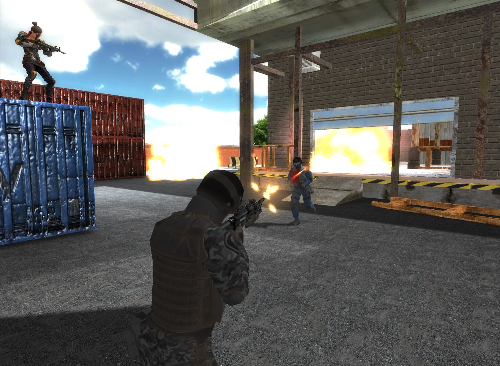
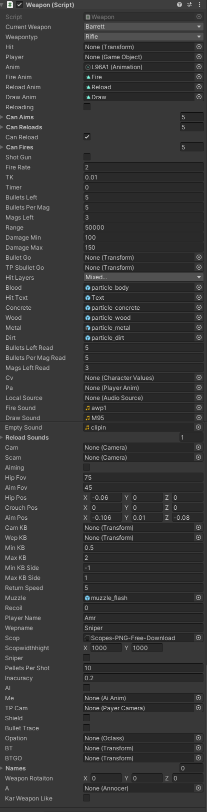

  <!-- Image of the weapon system in the middle -->
  

    
  

  

  <!-- Image of the weapon system -->
  

    
  

  <!-- Description of the game and weapon system -->
  

    

      A fast-paced first-person shooter multiplayer game set in various action-packed arenas. The game 
      features a range of weapons, including sniper rifles, SMGs, shotguns, and rifles, each offering a 
      unique combat experience. Players can log in through a dedicated system tied to a database, tracking 
      their progress and stats.
    

    

      The weapon system is designed to be highly adaptable, enabling seamless customization of weapons. 
      Parameters such as fire rate, projectile count, and more can be tweaked to suit different playstyles, 
      making the system versatile for a wide variety of weapons. 
      <strong>View an image of the weapon system next to it.</strong>
    

    

      The game includes several modes, with AI-controlled bots adding an extra challenge in both multiplayer 
      and solo play. Players can dive into waves mode, battling increasingly difficult enemy hordes, or face 
      off against relentless zombies in a tense survival scenario.
    

    

      Developed entirely from the ground up, the game merges smooth shooting mechanics with intense AI and 
      multiplayer action, providing a rich, immersive experience for players.
    

  

<!-- Video showcase -->

  <h3>Gameplay Video</h3>
  <video width="600" controls>
    <source src="../img/fps/video2.mp4" type="video/mp4">
    Your browser does not support the video tag.
  </video>

